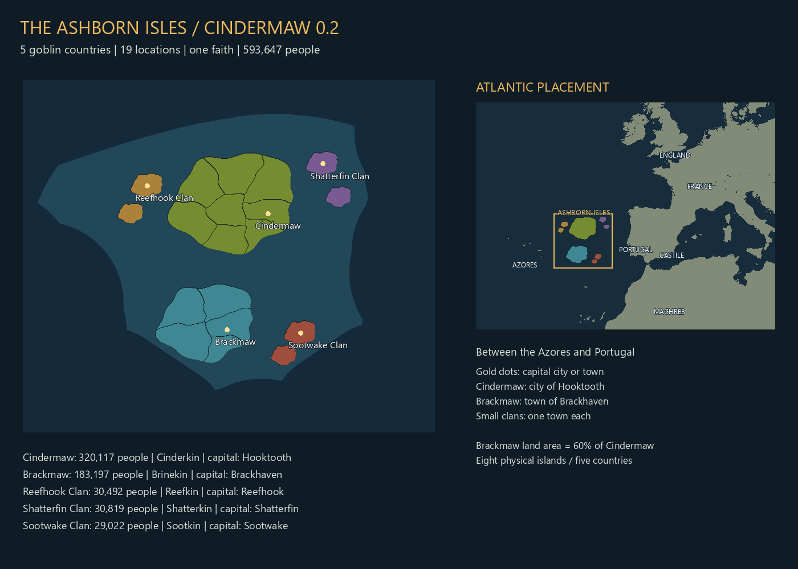
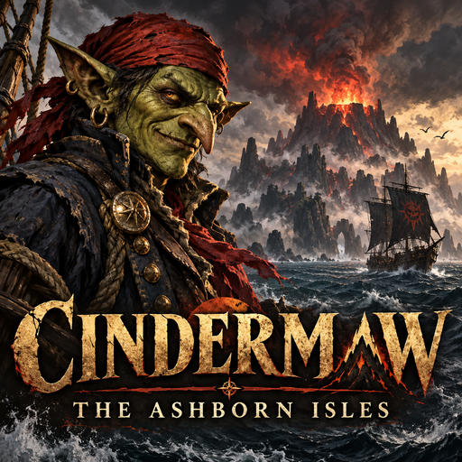

# Cindermaw 0.2 - The Ashborn Isles

Development update for installed EU5 **1.3.11** (Steam build 24187685). Static checks are separate from an in-game pass. This update has not yet been tested in EU5.





## Changes

- Cindermaw has roughly **2.66 times** its original land area, eight locations and **320,117 people**.
- **Hooktooth is the capital and a city**, with a marketplace, naval-supplies guild and stockade. The treasury remains poor at 20 gold.
- **Brackmaw** is a separate country on an island with **60% of Cindermaw's land area** (linear dimensions scale by the square root of 0.6). It has five locations, 183,197 people, Brinekin culture and Brackhaven as its capital town.
- Three independent clans each hold a two-island chain: **Reefhook**, **Shatterfin**, and **Sootwake**. Their populations are 30,492, 30,819 and 29,022 respectively; each has its own culture and capital town.
- All five cultures belong to **Goblinkin**, speak Cinder Tongue, and follow **The Hunger Below**.
- Total: **five countries, eight physical islands, 19 land locations, 593,647 people**. There are 6,000 enslaved Cinderkin in the initial setup; no vanilla population is removed.
- The islands now sit **in the eastern North Atlantic, between the Azores and Portugal**, in the previously impassable Azores-Biscay ridge area. Their coastal basin connects to the existing navigable sea network. Existing land and navigable sea-lane pixels are unchanged.
- Island sizes and center offsets derive from the main island's dimensions. Population counts are intentionally uneven and fixed in the source; rebuilding never rerolls them. Editing `radius` scales the group together; the 60% sister-island ratio is checked after rasterization. The builder rejects overlap with vanilla land/routes or between islands rather than silently breaking the map.
- Internal boundaries use smooth, irregular curves instead of straight Voronoi edges. The same boundary warp drives terrain transitions; every location remains a single connected district.
- The faction lore and opening event describe the early-1300s volcanic emergence and the divided goblin islands in 1337. See `LORE.md`.

The Atlantic placement puts Portugal and Castile nearby, with France, England and the Maghreb as later coastal targets. The island climate is oceanic and the main food crop is wheat.

## Fixes prompted by the first playtest

The game log rejected BOM-prefixed starting-world keys (`?locations`, `?market_manager`, `?current_age`). The new build writes setup scripts as UTF-8 **without BOM** and retains BOM for localization. This addresses the ignored population/city/market setup; 593,647 is the intended new-campaign total, not a claim of a runtime-verified display.

The combat tags now drive the terrain generator: mountain districts receive volcanic cones and crater rims, hills receive rolling relief, and flatland districts have much lower relief. The builder records each location's tag and minimum/median/maximum height above sea level. Narrow transitions blend between districts and coastlines taper to sea level.

The original demo supplied an unbaked terrain decal, while this installation loads a prebuilt terrain cache with static decals disabled. This build instead patches the native runtime **heightmap, material and index PNG tile streams**, including their mip levels and tile borders. It samples valid material/index combinations from Madagascar and preserves every untouched tile reference and unaffected pixel. Obsolete demo decals are removed from the staged build.

This is a programmatic native-cache patch, **not an editor export or an in-game rendering pass**. Close-up terrain, material appearance and navigation must still be checked in EU5.

## Thumbnail

The 512 x 512 PNG (525,305 bytes, under 1 MB) is embedded at `mod/.metadata/thumbnail.png` in the source and `cindermaw_demo/.metadata/thumbnail.png` in the prepared mod. The installer preserves it. It is a placeholder for the mod listing; no Steam publication has been performed.

## Install

1. Extract `Cindermaw_Demo_0.2.0.zip` into a writable folder. **Close EU5 completely.**
2. Run `Install-Cindermaw.ps1` from the extracted folder. It finds EU5 through Steam's library configuration, checks the original cache hashes, reconstructs the terrain files in the extracted folder, and installs the mod. It backs up the prior Cindermaw outside the mod scan directory.
3. If detection fails, run:
   `powershell -ExecutionPolicy Bypass -File .\Install-Cindermaw.ps1 -GamePath "E:\SteamLibrary\steamapps\common\Europa Universalis V\game"`
   Substitute your installation's `game` folder.
4. Restart EU5. Enable **only Cindermaw** in a dedicated playset and start a **NEW 1337 campaign**. Existing saves retain their old population and map state.
5. Use `TESTING.md`. Hooktooth should start as a city with about 63,973 residents, within Cindermaw's 320,117 total.

**The ZIP uses compact terrain deltas. Do not just copy its unprepared mod folder.** The installer first reconstructs about 1.8 GB of native cache files from your own game installation. No Python is required for installation. Allow roughly 4 GB free for extraction/preparation plus the installed copy. It never writes to the Steam installation.

For manual installation, run the installer with `-PrepareOnly` (and `-GamePath` if needed), then copy the complete prepared `cindermaw_demo` folder into your actual Documents folder under `Paradox Interactive/Europa Universalis V/mod/` while EU5 is closed. A prepared source build already contains the reconstructed cache.

To disable, choose a playset without this mod. Keep its saves separate. Jerusalem and other map/setup overrides require a compatibility build; they are not changed by this update.

## Build and source

Python 3.11+, NumPy and Pillow:

```powershell
python -m pip install -r requirements.txt
python tools/build.py --game "E:\SteamLibrary\steamapps\common\Europa Universalis V\game"
python tools/package.py
```

`data/island.json` is the source of geometry, countries and populations. `tools/archipelago.py` handles derived geography and world setup. `tools/terrain_cache.py` patches the installed cache format. `build/reports/validation.json` records source hashes, population totals, ports, island ratios and checks. Rebuild after EU5 updates: the installer intentionally rejects mismatched cache versions.

Authored source is tracked in the local Git repository. Generated vanilla overrides and caches are excluded. The source ZIP contains no original game assets.

## Remaining work

Human placeholder portraits; species-specific biology/assimilation; detailed clan diplomacy and invasion AI; more varied island shapes; runtime economy balancing; editor-generated settlement/army locators and navigation verification. Small clans currently use vanilla AI behavior and have no scripted opening invasion fleet. Cindermaw's opening fleet is created once on its first monthly country pulse.
