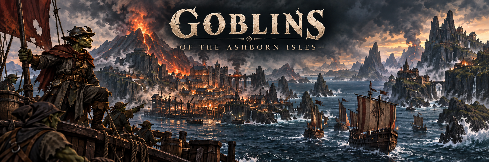
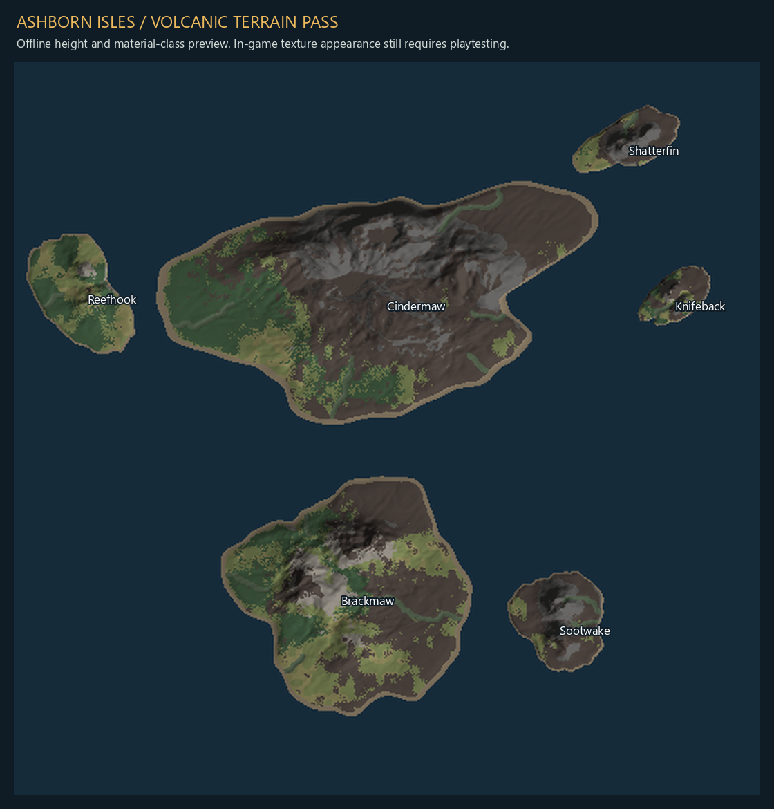
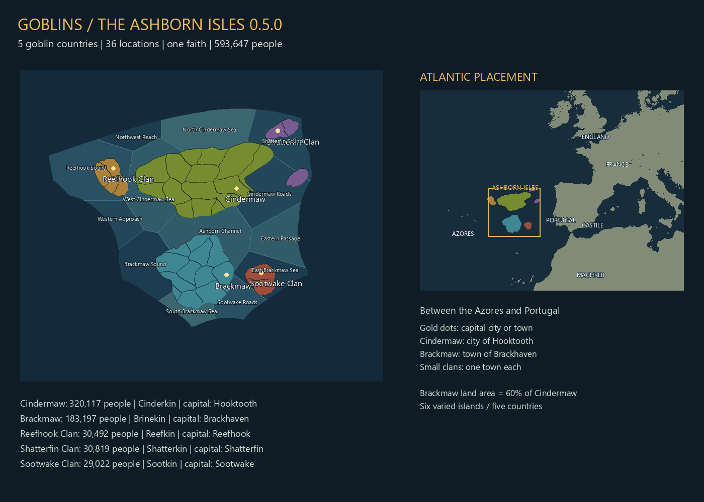

# 0.5.5 — Gathering prototype

The prototype also adds **323,941 goblins of minority cultures**, bringing the
starting population to **1,618,696**. Minorities make up roughly **16–22%** of each
nation; the home clan remains **78–84%**. All 72 districts across the six islands
contain all five Ashborn cultures, with varied counts that stay fixed between
installs. These communities represent migration, captives taken in inter-clan
raids and their descendants. Of the additions, **231,332 are slaves** and
**92,609 are free goblins**: laborers, peasants and capital merchants.

| Nation | Added minorities | Of those, slaves | Minority share | Total population |
|---|---:|---:|---:|---:|
| Cindermaw | 159,949 | 133,351 | 22.4% | 712,688 |
| Brackmaw | 73,355 | 50,012 | 18.7% | 391,818 |
| Reefhook | 21,955 | 10,414 | 16.8% | 130,392 |
| Shatterfin | 49,120 | 28,543 | 18.7% | 262,607 |
| Sootwake | 19,562 | 9,012 | 16.1% | 121,191 |

Cindermaw receives the largest influx and slave share. Capitals attract more
newcomers and free merchants; mining districts favor captive labor. Existing
populations and classes are preserved. Run the prototype installer again, load
the prototype after the 0.5.4 base, and start a new campaign.

The 0.5.5 update gives all five kingdoms distinct Gathering introductions and royal-family stories. Cindermaw, Brackmaw, Reefhook and Sootwake also receive revised ruler abilities and expanded culture descriptions. Shatterfin’s Jaima brings the maternal house’s terms to the Gathering and receives her own follow-up event. Their shared Ashborn origins support military leadership, control of supplies, maritime bargaining, maternal continuity and woodland independence.

## Rulers and faction identities

| Kingdom | Starting ruler | Nickname | Administration | Diplomacy | Military | Gathering introduction |
|---|---|---|---:|---:|---:|---|
| Cindermaw | Drogg Cindermaw | The Stone Fletcher | 78 | 80 | 96 | One Fire, Many Blades |
| Brackmaw | Murgash Brackmaw | The Sluice-King | 84 | 78 | 90 | The Sluice-King's Bargain |
| Reefhook | Skrezz Reefhook | The Wreck-Taker | 62 | 88 | 90 | The Wreck-Taker's Share |
| Shatterfin | Jaima Shatterfin | The Mare-Mother | 66 | 58 | 52 | The Tidemother's Terms |
| Sootwake | Snikh Sootwake | The Blackbough | 80 | 54 | 90 | Beneath the Blackbough |

Jaima’s 66/58/52 abilities are unchanged from the 0.5.4 base. Shatterfin retains its Stormfang identity and maternal dynastic seniority.

**Cindermaw — Emberblood:** The largest Ashborn kingdom, ruled from Hooktooth by King Drogg, **the Stone Fletcher**, who earned his nickname defending the harbor with volcanic arrowheads when iron ran short. Muster yards, forge captains and volcanic ridge defenses sustain its military power; weapons contracts, patronage, marriage negotiations and protection extend its influence across the Isles. House Cindermaw's saying is **“One fire, many blades.”** Drogg expects to lead the Gathering, while Queen Grakka counts the cost and their son Grask seeks a command. His abilities are 78/80/96 ADM/DIP/MIL. The expanded Emberblood description and **One Fire, Many Blades** introduction give the main faction a commanding role, with supply demands and rival crowns testing its ambitions.

**Brackmaw — Brineward:** Murgash Brackmaw, **the Sluice-King**, earned his nickname by sacrificing his own hall's embankment to save Brackhaven's granaries in the Blackwater Flood. He built his authority on tidal gates, dry granaries and debts remembered. Brackhaven's timber crews, ropewalks and coastal workshops supply his bid to make every Ashborn crown dependent on his harbor, giving him bargaining power over the provisions Drogg's campaigns require. The marsh houses expect maintained waterways and a voice in the labor he demands. His administration and diplomacy now reflect that identity (84/78/90 ADM/DIP/MIL); his house, family and succession remain intact. The Brineward culture text and Brackmaw's Gathering introduction tell this story in game.

**Reefhook — Reefstrider:** Skrezz Reefhook, **the Wreck-Taker**, is a charming captain who rescued stranded fishers at the Lantern Shoals and salvaged their hulls to replace the lost boats. House Reefhook's rescue beacons and pilotage obligations bind it to the fishing households; its saying is **“Bring the crew home; reckon the cargo after.”** Older brother Krizzek challenges Skrezz's costly foreign friendships, while consort Zikka connects the crown to House Shoalcut's pilots. Pearls, safe passage and divided salvage offer influence, but growing settlements need food and dependable buyers. Skrezz starts at 62/88/90 ADM/DIP/MIL.

**Sootwake — Ashveil:** Snikh Sootwake, **the Blackbough**, kept a scorched branch after holding the Red Hollow firebreak while families escaped. House Sootwake guards forest paths and cutting rights under the saying **“Roots outlast fire.”** Older brother Zhor presses the wardens' timber claims; consort Zheska of House Cinderhush speaks for the charcoal settlements. New hearths strengthen the kingdom while straining the groves that shelter it. Snikh starts at 80/54/90 ADM/DIP/MIL. Both houses retain their names and existing family relationships and succession rules. See [LORE.md](LORE.md) for their expanded stories.

**Shatterfin — Stormfang:** Jaima Shatterfin, **the Mare-Mother**, joins the Gathering as a potential leader, ally or consenting vassal with terms of her own. Her maternal house connects crews and households across two islands. Sister Skritcha is the initial eligible successor; daughters Morzha and Rikkra belong to the maternal line, while son Vrosh cannot inherit under the Tidemother law. **The Tidemother’s Terms** (`ga_gathering.13`) introduces these interests. Thirty days after that introduction, **The Maternal House Endures** (`ga_gathering.15`) gives Shatterfin a second, once-only family-council event. Both are narrative events; they appoint no heir, change no law and settle no treaty.

## What changes in play

**Custom event and situation art:** seventeen original Ashborn paintings cover
all fourteen Gathering events, the Cindermaw introduction and all six exploration
and first-contact events. Both situations have custom headers and icons. The five
clan introductions illustrate their own stories; related oath and unification
events share matching scenes. The prototype installer includes the textures and
explicit image references. See [art/events/README.md](art/events/README.md) for
originals, prompts, mappings and reproducible DDS exports. In-game rendering
remains pending.

The four revised ruler ability sets replace their previously shared 66/61/90 values; Jaima keeps 66/58/52. Brackmaw, Reefhook and Sootwake gain their nicknames; Drogg keeps his existing Stone Fletcher nickname. Expanded culture descriptions for four kingdoms, five rewritten introductions and Shatterfin’s follow-up bring the identities into the game. [LORE.md](LORE.md) contains the ruler, dynasty and national stories for all five kingdoms.

The house sayings, family interests, military customs, rescue obligations and woodland rights are narrative flavor. They do not add new institutions, court appointments, economic bonuses or diplomatic actions. Existing family relationships, house names, birthdays and succession laws are preserved, as are geography and the costs of situation actions. The population additions are described above.

Two situations, seven actions and fourteen events connect all five Ashborn kingdoms to a shared unification struggle and then an eastern coastal ambition. Conquest and consent-based vassalage use native mechanics; unions obtained normally count toward unification. Eastern actions provide paid bonuses and a temporary conquest casus belli, never free foreign land or automatic wars.

## Installation and verification

The prototype installer includes all five kingdoms’ Gathering events and the four ruler/culture overrides. It derives the required character and localization overrides from the installed 0.5.4 base. Preparation from a clean source export, installation into isolated test data, checksum checks and comparisons against the full-build character generator have passed. All unrelated character and localization entries were preserved. Native-reference checks and all 14 ownership scenarios also passed.

**Prototype: static checks pass; in-game parsing, UI, AI and balance remain untested.** Use the small additive installer with the installed **0.5.4** base: download this branch, close EU5, run **Install-Prototype-055.cmd**, then enable both mods and start a new campaign. The regular installer is not a 0.5.5 release package. See [PROTOTYPE_055.md](PROTOTYPE_055.md) for installation, exact mechanics, limitations and tests.

# 0.5.4 — Districts and Dynasties

Built on tested staging/0.5.3. EU5 1.3.11; a new 1337 campaign is required.

- 1,294,755 goblins. The initial +15% pass is followed by at least another +50% for every clan; smaller clans receive a larger uplift. Location and population-class shares are preserved with whole-person rounding. Shatterfin is the largest smaller clan.
- 36 → 72 inhabited locations and 15 → 30 provinces. Every original location and province is subdivided. Stable country tags, original location IDs, capitals, coastlines and thirteen sea zones remain.
- Starting building levels rise from 47 to 114: stronger capital markets, five granaries, tools/cloth/pottery guilds, rural villages, wheat windmills and smelters on iron/copper RGOs.
- Once-only, ownership-checked first-month RGO expansion rises from 70 to 387 levels across the larger map.
- New RGOs: 2 gold, 3 silver, 2 dyes, 2 saffron, 1 silk, 1 pearls and 2 alum. New food/timber/material districts support basic demand; original districts retain their resources. Native gold ID: goods_gold.
- Ironfang: strongest eligible adult Ashborn man within the ruling dynasty inherits. Military ability decides, with Administration and age breaking ties. Unrelated courtiers cannot inherit through this law; no eligible dynasty member means no eligible heir.
- Native country naming follows the reigning house after a takeover or dynasty reassignment; succession hooks and monthly reconciliation cover changes. Regents do not rename the country. Shatterfin keeps maternal seniority.
- Starting ruler ages vary: Cindermaw 38, Brackmaw 36, Reefhook 27, Shatterfin 39 and Sootwake 29. Consorts and courtiers also have varied birthdays. Family birth dates retain plausible parent ages and adult dynastic heirs (brothers for the younger rulers). Shatterfin keeps four eligible adult women and maternal seniority.
- A native character auto modifier gives all five Ashborn cultures +15 years of life expectancy, including future characters and goblins employed abroad; human characters receive no species bonus.
- Retains 0.5.3 human portrait isolation, working shared-pose infantry, recruitment art and first-contact events.

| Clan | Starting population | Increase over first 0.5.4 pass |
|---|---:|---:|
| Cindermaw | 552,739 | 50.15% |
| Brackmaw | 318,463 | 51.16% |
| Reefhook | 108,437 | 209.23% |
| Shatterfin | 213,487 | 502.36% |
| Sootwake | 101,629 | 204.52% |

Installed Europe reference medians: 520 map pixels/location, 2,626 pixels/province and 5 locations/province. The new districts use this spatial scale as a reference while preserving the islands' smaller political units.

Volcanic/hydrothermal seams explain gold, silver and alum; reeds/lichens supply dyes; drained sheltered volcanic plots grow saffron. Knifeback has a small cultivated silk grove and Reefhook has pearl-diving grounds. These are fictional resources appropriate to the setting.

Extra production capacity is not guaranteed profitability. Food, employment, balance and succession require gameplay acceptance. Use only a verified matching 0.5.4 installer; older instructions below refer to earlier releases.

# Goblins of the Ashborn Isles — 0.5.3 staging



Canonical integration branch: **staging/0.5.3**. This combines the portrait pass, tested map-infantry repair, recruitment illustrations, companion first-contact event, and Workshop preparation. Download this branch into a fresh folder and run `Install-Goblins.cmd` with EU5 closed. No Workshop publication is performed by this branch.

Packaging checks are separate from gameplay acceptance. The map-infantry repair passed the user's test; the new recruitment illustrations and companion event still need their in-game acceptance checks. See [TESTING.md](TESTING.md). Deferred model appearance work: [issue #4](https://github.com/stonefletcher/eu5-goblins-ashborn-isles/issues/4).

## 0.5.3 infantry attachment repair — user tested

Native fallback infantry were visible and did not reproduce the crash in the user's test. Custom goblin infantry are now re-enabled through the native attachment workflow: the base graph supplies the skeleton, transform and animation machine; a named shared_pose_entity attachment supplies the visible mesh. The direct root MeshType is removed.

The user confirmed on October 6, 2026 that the repaired infantry no longer crashes and appears properly. The precise engine fault is not proven, and exhaustive state coverage is not claimed. Visual refinement is deferred in issue #4: make the units less goofy while preserving this working attachment route. Continue regression checks for movement, combat and save/reload.

## 0.5.3 development: rough-clad goblins

Infantry recruitment and army cards now have original painted goblin artwork
for all five Ashborn cultures. Native recruitment, statistics and human artwork
are unchanged. This first pass shares one medieval painting across infantry
types and ages. The prepared installer includes this art alongside the latest
shared-pose model repair and first-contact event. In-game acceptance is pending.

Portrait refinement: ears now extend 9 cm from their base (previously 5.8), with longer hooked noses, smaller jaws/chins, prominent cheeks, wider mouths and smaller teeth. A culture-only special gene applies compact torso proportions and a mild stoop to adult males and females, fading out during childhood. Human cultures remain outside these modifiers. Exact stature, portrait framing and clothing fit await engine review.

Infantry repair candidate: connect the missing translation input explicitly, consume the native CustomAnimationMachineName parameter, and write graphics scripts with a UTF-8 BOM. Typed graph-link checks now complement mesh/animation validation. The prior graph was rejected in the game log; the subsequent shared-pose attachment repair has now passed the user's visibility/crash test.

First art pass on a separate branch based on 0.5.2. Infantry stature is reduced from 1.12 m to 0.92 m, jaws are narrower and teeth smaller. Clan skin palettes are muted olive, marsh, lichen, slate and soot greens. Portrait recoloring retains 12% of underlying albedo detail.

Portraits select native plain harnesses, wraps, jackets and overcoats for both sexes and all Ashborn cultures, including rulers and courts. Crowns, normal court clothes, capes and neck ornaments are overridden. Children retain basic clothes and infants retain a single native swaddle.

Static model, animation, texture, rig and clothing-reference checks pass. In-game appearance remains unverified. Exact full-body stature and custom torn/patchwork leather-and-rag art remain pending. This branch includes a prepared 0.5.3 installer. Download a fresh branch ZIP, extract it into a new folder and run Install-Goblins.cmd with EU5 closed. In-game art acceptance and Workshop publication remain separate.

[Repository](https://github.com/stonefletcher/eu5-goblins-ashborn-isles) | [Origins and lore](LORE.md) | [Testing checklist](TESTING.md) | [Release notes](RELEASE_NOTES.md)

## The goblin nations (0.5.3 population reference)

In the early fourteenth century, fire rose from the Atlantic. New islands emerged, and goblins already walked their shores. No fleet had brought them. Whether the mountains birthed them or opened passages beneath the world remains disputed.

By 1337, fishing camps have grown into ports, mines work the volcanic ridges, and rival captains fight for sheltered harbors. The islands share Cinder Tongue, the Ashborn cultural heritage and the Hunger Below faith, but remain divided into five countries.

| Country | Culture | Capital | Capital rank | Population |
|---|---|---|---|---:|
| Cindermaw | Emberblood | Hooktooth | City | 320,117 |
| Brackmaw | Brineward | Brackhaven | Town | 183,197 |
| Reefhook Clan | Reefstrider | Reefhook | Town | 30,492 |
| Shatterfin Clan | Stormfang | Shatterfin | Town | 30,819 |
| Sootwake Clan | Ashveil | Sootwake | Town | 29,022 |

There are **six physical islands, 36 land locations and 593,647 people**. Cindermaw has 15 locations, Brackmaw 12, Reefhook four, Shatterfin three across two islands, and Sootwake two. Here, the requested state counts refer to playable land tiles (EU5 locations); the larger province groupings are retained. Brackmaw's land area remains approximately 60% of Cindermaw's.

Population values are fixed, uneven counts, including 6,000 enslaved Emberblood. Vanilla population entries are preserved. Cindermaw remains the name of one country and island; the mod represents all the Ashborn.

The **Ashborn** culture group includes Cindermaw's forge-bound **Emberblood**, Brackmaw's marshland **Brineward**, Reefhook's shoal-wise **Reefstriders**, Shatterfin's seafaring **Stormfang**, and Sootwake's woodland **Ashveil**. These names replace the old -kin labels. Existing culture IDs remain stable for saves and scripts.

## Goblin infantry models

Main includes five clan skin palettes, native `.mesh` files, DDS materials and 17 converted animations from the licensed model sources in [art/models/goblins](art/models/goblins/README.md). Light and heavy infantry select their clan model through dedicated culture graphics tags. The first pass uses the shared short goblin body and its own rig; clothing, weapon fitting, cavalry and artillery crews need separate work. Portraits now use the separate test pass below. Infantry movement, attack, retreat and charge use the source animations; the exported death clip is available but is not yet connected to a verified game death event.

Native animation checks compare 51 decoded poses against their GLB sources, with a maximum difference below 0.002 cm. Native mesh and animation files also pass byte-exact reader/writer checks. These checks do not prove in-game rendering. Restart and follow TESTING.md before accepting the models.

## Geography and terrain

The islands lie between the Azores and Portugal. Six distinct silhouettes use bays, headlands and curved internal borders. **Thirteen compact coastal sea zones** follow the surrounding vanilla Atlantic boundaries, with separate northern, western and eastern waters around Cindermaw and a southern channel. All new zones are navigable and connected to native routes; vanilla land and navigable sea pixels are preserved.

The 0.5.1 terrain pass reduces land area by 12% relative to 0.5.0 while retaining the surrounding sea basin. Cindermaw–Brackmaw and Brackmaw–Sootwake have at least 24 map pixels of shoreline clearance, enforced by the build. Each island has individually authored bays and broad headlands, with subdued small coastal erosion rather than a repeated scalloped outline. Reefhook remains about 20% larger than either Shatterfin's combined islands or Sootwake.

The landscape now follows island geology rather than location seeds or gameplay terrain tags. Cindermaw has a connected volcanic mountain spine, branching foothills, eroded valleys and a crater. Each island has its own relief, woodland distribution, beaches, exposed rock and short river catchments. Wider craters have raised rims; weathered lava aprons and dry lee slopes add dark ground and exposed rock. Woodland retreats from volcanic ground and remains strongest in sheltered, moist valleys. Native Madeira and Sao Miguel height tiles were examined as references for ridges and coastal transitions. The game uses 32 world units for the entire 16-bit height range; our much larger islands have higher peaks than those native small islands.

A local visual biome and painted material tiles remove the previous province-shaped grass/rock patches while preserving combat topography and vegetation rules. The visual override is restricted to an Atlantic rectangle verified to contain no native land. Native tree and rock meshes are placed away from settlements, channels and steep summits. River sources and one-pixel channels use the native river palette. Terrain cache seams, centre continuity, size ratios, scenery transforms and administrative independence are checked automatically.

**These are generated assets, not an in-game render certification.** Inspect `reports/Goblins_Cache_Relief.png` and perform the new-campaign checks in TESTING.md. The biome shader override also needs an engine rendering check and can conflict with other terrain shader mods.



The preview above uses generated elevations and diagnostic material colors; it is not an in-game screenshot. Regenerate it with `python tools/preview_geology.py`.

## Exploration

All five goblin countries initially know only the Ashborn land and sea areas. Foreign countries retain their native starting knowledge until a goblin voyage reaches them.

After roughly four monthly pulses, an event offers a **5-gold eastern voyage**. Four months after funding, the returning crew reveals the western Iberian sea route and Porto, Lisbon and Setubal. After a year, further events offer **10-gold northern or southern voyages**, each taking six months. Northern charts reveal the Bay of Biscay, English Channel and five coastal towns; southern charts reveal the northwest African coast, Cadiz, Tangier and Ceuta. Uncharted inland regions remain terra incognita. Each route completes once per country; postponing costs nothing and brings another offer in six months. Each goblin country keeps its own charts. On each completed voyage, the current owners of the visited coastal locations discover the Ashborn land and sea areas. The script follows current ownership, skips unowned locations, and does not reveal the isles to unrelated countries.



## Government and economy

Four countries start as **Ironfang Monarchies**; Shatterfin instead uses **Tidemother Monarchy**. The Ironfang reforms are implemented as a unique major reform on the native monarchy type. They use legitimacy and normal monarchy mechanics. **Rule of the Strongest** selects an eligible adult male Ashborn character from the country when the ruler dies. Military ability is the primary score (1000x); administrative ability and then age break ties. It is not restricted to the ruler's dynasty or noble estate. Children, foreign rulers and characters barred from ruling are excluded. There are no periodic elections or challenges. The succession rule is unlocked: normal monarchy alternatives remain selectable. Removing the Ironfang reform falls back to Salic succession if the special rule is still active.

Every country has a capital marketplace, wharf and one or two modest guilds. Hooktooth produces tools and naval supplies; Brackhaven cloth and pottery; Reefhook pottery; Shatterfin tools; Sootwake cloth. Rural locations have 27 levels of suitable farming, fishing, forest or market villages in total, plus two fiber-crop farms. Added clay, tar, fiber-crop and wool sites supply the small industries through the shared Hooktooth market. Worker populations are redistributed within the unchanged national totals.

On the first monthly pulse, a guarded initialization expands RGO worker capacity by 70 levels across the 36 locations. It runs once per country and checks location ownership. Villages and guilds exist at campaign start. The isles receive a modest starting development adjustment (+7, with another +3 in capitals). Starting treasury: Cindermaw 50, Brackmaw 35, and each minor clan 20 gold.

The old 15% tax-income penalty is removed. Cindermaw's first-month force is reduced to one footmen unit, two galleys and three cogs; it keeps the Hooktooth stockade. The other capitals no longer start with upkeep-heavy stockades. These changes improve productive capacity and reduce recurring costs, but **positive monthly balances have not yet been measured in the engine**. Check prices, employment, control and budgets after several monthly pulses.

The opening lore event now has a single **The Ashborn rise.** option. The two old buttons only showed different advice and produced identical gameplay outcomes.

**Dedicated foreign coveting/fear mechanics are not implemented yet.** England, Castile/Spain and other powers do not yet have scripted ambitions toward these islands. Portrait appearance testing, deeper clan diplomacy, long-term balance and multiplayer testing remain future work.

## Install the test build

You can also use GitHub's **Code > Download ZIP** on `feature/shatterfin-matriarchy`: extract it and run `Install-Goblins.cmd`. The installer reconstructs and verifies the bundled release archive automatically before installing. A source-only archive without `.release/` still requires building first.

1. Close EU5 completely and extract **Goblins_Ashborn_Isles_0.5.2.zip** into a writable folder.
2. Double-click **Install-Goblins.cmd**. The installer prepares terrain caches from your matching EU5 installation, checks hashes, backs up the previous installation and installs `goblins_ashborn_isles` under the EU5 user-data `mod` folder.
3. Existing playset references to `cindermaw_demo` are migrated. Enable **Goblins of the Ashborn Isles** alone for this test.
4. Restart EU5 and start a **new 1337 campaign**. Do not reuse a save from an earlier map layout.

If game detection fails, run `Install-Goblins.ps1 -GamePath "E:\SteamLibrary\steamapps\common\Europa Universalis V\game"`. Installation needs roughly 4 GB of working space and does not modify Steam's files. The compact ZIP contains terrain deltas: do not manually copy its unprepared mod folder. Use `-PrepareOnly` first for a manually copied installation.

## Build from source

Python 3.11+, NumPy and Pillow are required. For a source archive, first extract **Goblins_Ashborn_Isles_Source_0.5.2.zip**, which contains the complete authored source tree.

```powershell
python -m pip install -r requirements.txt
python tools/build.py --game "E:\SteamLibrary\steamapps\common\Europa Universalis V\game"
python tools/package.py
```

The generated mod goes to `build/goblins_ashborn_isles`, reports to `build/reports`, and packages to `dist`. Game-derived overrides and full terrain caches are excluded from the source archive and Git tracking.

The banner is `art/Goblins_Banner.png`; the 512 x 512 Workshop thumbnail is `.metadata/thumbnail.png` beside the metadata. Existing `cm_` location identifiers and the event namespace remain stable technical keys.

## Changelog

| Version | Changes |
|---|---|
| 0.5.0 | Larger islands, larger Reefhook, 26 locations/expanded provinces; independent geology and material painting, trees, rocks and rivers; Ironfang Monarchy and changeable strongest-male succession; mutual exploration contact; village/RGO/capital production and reduced starting upkeep; one-button introduction. In-game testing pending. |
| 0.4.1 | Fix radial height discontinuities at island centres; soften terrain boundaries and regular ridge patterns; stronger mountain and hill relief in native world units; centre-continuity and final-cache coverage/relief checks for all 19 locations; decoded-cache preview. Rendering acceptance remains pending. |
| 0.4.0 | Thirteen compact sea zones; continuous coastal slopes and filtered terrain mips; remove invalid regional heightmap override; sea VFX anchors; local-only starting knowledge and optional exploration voyages for all five clans. Runtime acceptance remains pending. |
| 0.3.0 | Goblin-focused name and artwork; six distinct islands; three registered sea zones; settlement/unit/dock locators; stronger volcanic relief and less vegetation; overview heightmap update; election, encoding and event fixes; renamed packages and installer with legacy-folder migration. |
| 0.2.0 | Atlantic archipelago with five countries, populations, urban capitals, shared heritage and faith, terrain cache patch, and lore. Playtesting exposed unregistered coastal waters and missing locators. |
| 0.1.0 | Initial single-island development demo. |

## Compatibility and testing

Follow **TESTING.md** before treating this as release-ready. Restart and a new campaign are required after map changes. Other map or starting-world mods may conflict, including Crusader States without a compatibility build. Rebuild after game updates; installation rejects mismatched terrain caches. Achievements, multiplayer and long-term balance are untested.

To disable, choose a vanilla playset, restart EU5 and use an unmodded campaign. EU5 and its assets belong to Paradox. The banner and thumbnail were created with image generation.

## Publishing prepared releases

The main branch stores the authored source tree and the merged prepared release under `.release/`, so Download ZIP can install without a local build. Release branches carry hash-listed base64 chunks of the locally built install/source archives. The publishing workflow verifies their sizes, SHA-256 hashes and ZIP integrity, then creates a GitHub test release tagged at the manifest's source commit. It will not overwrite an existing release. The installer verifies and unpacks the prepared archive into `.prepared-release-VERSION/` when no built mod is present.


## Culture-based portrait test pass (main only)

All five Ashborn cultures now select their own portrait ethnicity and deterministic
appearance modifier. The rules follow the character's culture, not their employer,
country, sex, or office. This targets ruling families, cabinet members, other
characters and culture-generated population portraits. Existing character DNA gets
the visible modifiers without a save-edit migration. Newly generated DNA also uses
the culture's ethnicity. Human cultures receive none of these modifiers.

The pass uses the native animated portrait faces and clothing, with custom rigged
pointed ears, jaw-bound tusks, goblin facial proportions, and matching head/body skin
colour. It does not reuse the infantry's whole-body mesh as a portrait. Adult male,
adult female, boy, girl, both adolescent types and infant are configured; infants
have smaller ears without tusks. Clan colours match the infantry art palette.

**Status: static checks passed; in-game appearance has not been verified.** Native
rig bindings, skin weights, geometry, asset references, all seven portrait types,
and all five culture routes are checked by `tools/verify_goblin_portraits.py`.
Clothing fit, expressions, child scaling and population portrait selection still
need a game test. Restart EU5 after installing a fresh main download; the published
0.5.0 ZIP does not contain this pass. Compare a ruler, relative, cabinet member,
woman, child and infant from each culture, plus a human character as a control.
Check skin on neck/hands, eyes, ear placement, tusks during animation, save/reload,
and a newly generated character. Send a screenshot and fresh error.log if wrong.

The separate infantry integration currently fails in-game with `Invalid entity
graph [cm_goblin_cindermaw_schematic]`, producing invisible infantry. Its repair is
deferred while portraits are prioritised; this portrait pass does not claim to fix it.


## 0.5.2 — Shatterfin Tidemothers (feature branch)

Shatterfin alone starts with **Tidemother Monarchy** and **Seniority of the
Tidemothers**. Normal monarchy institutions and the existing naval modifiers
remain. The oldest eligible adult Stormfang woman of the ruling dynasty inherits;
her mother must belong to that same dynasty. Age is measured to the day, with no
Military or administrative score. Men, minors, foreign rulers and blocked
characters are excluded. This is maternal dynastic seniority, not daughter-first
primogeniture or an election. The law can be changed through normal monarchy
controls; removing the reform falls back to absolute cognatic primogeniture.

**Jaima Shatterfin, the Mare-Mother** begins as Tidemother. Her younger sister **Skritcha** is the
oldest eligible successor, followed by Morzha, Rikkra and Krishka. Vrosh is excluded
because he is male despite his high Military ability; Zrikka is too young. The
family is authored parent-before-child, with a deceased maternal founder, Zhavra.
Children born in Shatterfin to women of the ruling house inherit their mother's
dynasty while the law is active. The birth action is restricted to Shatterfin and
this law. Other clans retain Ironfang Monarchy and Rule of the Strongest.

If no eligible adult woman survives, the rule does not silently admit a man or
an unrelated woman. The engine's handling of an exhausted candidate list needs
in-game testing. Existing campaigns are not forcibly migrated: use a new 1337
campaign for the authored dynasty and government setup.

This branch includes the 0.5.1 terrain source and the portrait test pass. Its
prepared installer and metadata are **0.5.2**. The branch remains separate from
main; the published 0.5.0 release is unchanged. Static setup and build checks do
not certify in-game succession, maternal inheritance or portrait rendering.


Naming proposals for all five Ashborn cultures are in [NAMING_PROPOSALS.md](NAMING_PROPOSALS.md). The approved dialect system is implemented in this version.

All five Ashborn cultures have 16 male and 16 female name entries, six house names and six lowborn names each. Four additional royal families and 15 adult courtiers are authored. In 0.5.5, all five starting rulers have nicknames: Drogg "the Stone Fletcher", Murgash "the Sluice-King", Skrezz "the Wreck-Taker", Jaima "the Mare-Mother" and Snikh "the Blackbough". Cabinet appointments remain native, drawing on culture-specific names and the available court.

