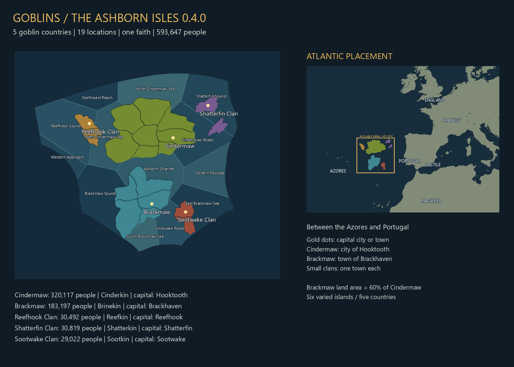

# Goblins of the Ashborn Isles


Five goblin nations rise from a volcanic Atlantic archipelago in this fantasy **Europa Universalis V** mod. Start in **1337**, unite rival clans, develop their ports and mines, and decide how the Goblinkin will face the wider world.

**Version 0.4.0 — development test build.** Targets EU5 **1.3.11 (Pavia)**, Steam build **24187685**. Static validation is required before packaging; in-game acceptance testing is pending. This is not a Steam Workshop release.

[Repository](https://github.com/stonefletcher/eu5-goblins-ashborn-isles) · [Origins and lore](LORE.md) · [Testing checklist](TESTING.md)

## The goblin nations

In the early fourteenth century, fire rose from the Atlantic. New islands emerged, and goblins already walked their shores. No fleet had brought them. Whether the mountains birthed them or opened passages beneath the world remains disputed.

By 1337, fishing camps have grown into ports, mines work the volcanic ridges, and rival captains fight for sheltered harbors. The islands share Cinder Tongue, the Goblinkin cultural heritage and the Hunger Below faith, but remain divided into five countries.

| Country | Culture | Capital | Capital rank | Population |
|---|---|---|---|---:|
| Cindermaw | Cinderkin | Hooktooth | City | 320,117 |
| Brackmaw | Brinekin | Brackhaven | Town | 183,197 |
| Reefhook Clan | Reefkin | Reefhook | Town | 30,492 |
| Shatterfin Clan | Shatterkin | Shatterfin | Town | 30,819 |
| Sootwake Clan | Sootkin | Sootwake | Town | 29,022 |

There are **six physical islands, 19 land locations and 593,647 people**. Cindermaw has eight locations, Brackmaw five, and each smaller clan two. Reefhook and Sootwake each occupy one island divided into two provinces; Shatterfin retains a two-island chain. Brackmaw's land area remains approximately 60% of Cindermaw's.

Population values are fixed, uneven counts, including 6,000 enslaved Cinderkin. Vanilla population entries are preserved. Cindermaw remains the name of one country and island; the mod represents all the Goblinkin.

## Geography and terrain

The islands lie between the Azores and Portugal. Six distinct silhouettes use bays, headlands and curved internal borders. **Thirteen compact coastal sea zones** follow the surrounding vanilla Atlantic boundaries, with separate northern, western and eastern waters around Cindermaw and a southern channel. All new zones are navigable and connected to native routes; vanilla land and navigable sea pixels are preserved.

Version 0.4.0 replaces the three broad water bands. Terrain now crosses sea level smoothly over a submerged shelf, and its zoom levels are filtered from one shared heightfield. The incorrect override of the game's legacy regional heightmap has been removed. These are source/cache corrections; **the reported in-game terrain problem still needs visual confirmation in a new test**. City, unit, combat, dock and sea VFX locators are included.

## Exploration

All five goblin countries initially know only the Ashborn land and sea areas. Europe retains its native starting knowledge; the mod does not reveal the goblins to foreign countries.

After roughly four monthly pulses, an event offers a **5-gold eastern voyage**. Four months after funding, the returning crew reveals the western Iberian sea route and Porto, Lisbon and Setubal. After a year, further events offer **10-gold northern or southern voyages**, each taking six months. Northern charts reveal the Bay of Biscay, English Channel and five coastal towns; southern charts reveal the northwest African coast, Cadiz, Tangier and Ceuta. Uncharted inland regions remain terra incognita. Each route completes once per country; postponing costs nothing and brings another offer in six months. Each country keeps its own charts.



## Government and economy

Captains elect their leaders through a custom confederation reform. Hooktooth starts as a city with a marketplace, naval-supplies guild and stockade; the other capitals are towns. One market serves the archipelago. Cindermaw begins with 20 gold and receives its opening force once on its first monthly pulse. Smaller clans use vanilla AI and have no scripted opening fleet.

The setup registers the custom election with republic governments, supplies the introduction event's outcome, and removes two starting-policy assignments that lacked required advances. Non-startup game scripts use UTF-8 BOM; starting-world setup files remain without BOM.

**Dedicated foreign coveting/fear mechanics are not implemented yet.** England, Castile/Spain and other powers do not yet have scripted ambitions toward these islands. Goblin portraits, deeper clan diplomacy, long-term balance and multiplayer testing remain future work.

## Install the test build

1. Close EU5 completely and extract **Goblins_Ashborn_Isles_0.4.0.zip** into a writable folder.
2. Double-click **Install-Goblins.cmd**. The installer prepares terrain caches from your matching EU5 installation, checks hashes, backs up the previous installation and installs `goblins_ashborn_isles` under the EU5 user-data `mod` folder.
3. Existing playset references to `cindermaw_demo` are migrated. Enable **Goblins of the Ashborn Isles** alone for this test.
4. Restart EU5 and start a **new 1337 campaign**. Do not reuse a save from an earlier map layout.

If game detection fails, run `Install-Goblins.ps1 -GamePath "E:\SteamLibrary\steamapps\common\Europa Universalis V\game"`. Installation needs roughly 4 GB of working space and does not modify Steam's files. The compact ZIP contains terrain deltas: do not manually copy its unprepared mod folder. Use `-PrepareOnly` first for a manually copied installation.

## Build from source

Python 3.11+, NumPy and Pillow are required. In the GitHub snapshot, first extract **Goblins_Ashborn_Isles_Source_0.4.0.zip**, which contains the complete authored source tree.

```powershell
python -m pip install -r requirements.txt
python tools/build.py --game "E:\SteamLibrary\steamapps\common\Europa Universalis V\game"
python tools/package.py
```

The generated mod goes to `build/goblins_ashborn_isles`, reports to `build/reports`, and packages to `dist`. Game-derived overrides and full terrain caches are excluded from the source archive and Git tracking.

The banner is `Goblins_Banner.png`; the 512×512 Workshop thumbnail is `.metadata/thumbnail.png` beside the metadata. Existing `cm_` location identifiers and the event namespace remain stable technical keys.

## Changelog

| Version | Changes |
|---|---|
| 0.4.0 | Thirteen compact sea zones; continuous coastal slopes and filtered terrain mips; remove invalid regional heightmap override; sea VFX anchors; local-only starting knowledge and optional exploration voyages for all five clans. Runtime acceptance remains pending. |
| 0.3.0 | Goblin-focused name and artwork; six distinct islands; three registered sea zones; settlement/unit/dock locators; stronger volcanic relief and less vegetation; overview heightmap update; election, encoding and event fixes; renamed packages and installer with legacy-folder migration. |
| 0.2.0 | Atlantic archipelago with five countries, populations, urban capitals, shared heritage and faith, terrain cache patch, and lore. Playtesting exposed unregistered coastal waters and missing locators. |
| 0.1.0 | Initial single-island development demo. |

## Compatibility and testing

Follow **TESTING.md** before treating this as release-ready. Restart and a new campaign are required after map changes. Other map or starting-world mods may conflict, including Crusader States without a compatibility build. Rebuild after game updates; installation rejects mismatched terrain caches. Achievements, multiplayer and long-term balance are untested.

To disable, choose a vanilla playset, restart EU5 and use an unmodded campaign. EU5 and its assets belong to Paradox. The banner and thumbnail were created with image generation.
