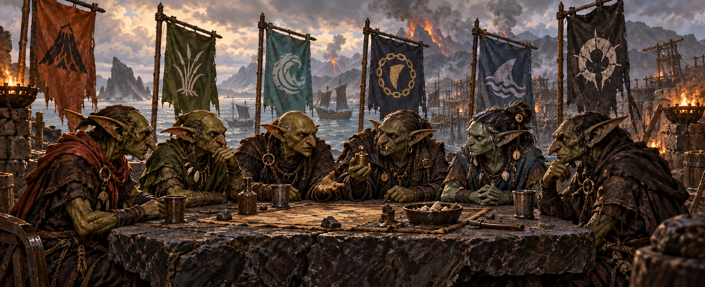

# Goblins of the Ashborn Isles

**Local 0.5.8 holy-site development — `feature/0.5.8-holy-site-variance`.**
Nine shrines now range from importance 1 to 5: three on Cindermaw, two on
Brackmaw and one on each smaller island. Existing site/event identities remain.
Native importance scales local bonuses; secondary shrines have modest effects.
This source change is not yet included in the inherited staging installer below.
Focused religion validation passed; new-campaign gameplay review is pending.

**0.5.8 portrait development candidate — `staging/0.5.8`.**
Reworks court, noble and character portraits toward the Gathering artwork:
small hooded eyes, lean weathered faces, folded ears, smaller teeth, shorter
necks and more compact, stooped bodies. Culture routing covers the five goblin
peoples while preserving human characters. Native beards are removed. Adults exclusively select hide tunics, fringed
leather overcoats and fur-trimmed hunter garments, replacing the earlier mixed
cloth wardrobe. Children retain fitted plain clothes; infants retain swaddling. Includes the 0.5.7 religion, estate,
exploration and diplomacy changes.

**Complete staging installer:** use [Code > Download ZIP](https://github.com/stonefletcher/eu5-goblins-ashborn-isles/archive/refs/heads/staging/0.5.8.zip), extract into a new folder and run Install-Goblins.cmd. The source and bundled installer both target **0.5.8 / EU5 1.3.11**.
Close EU5, extract into a new folder and run the installer. Enable one mod copy. The default main branch remains the released 0.5.7.
Use a new 1337 campaign to test inherited starting-world changes; also check
portraits in an existing save. This is a staging candidate, not a Steam release. The active installed profile
has not been changed. Full-build static checks pass. Bundle and isolated-install checks accompany
the delivered candidate; in-game appearance remains unverified.

See [portrait changes and visual checks](RELEASE_NOTES_0.5.8.md). Clothing uses inspected native leather/hide materials and fitted meshes.
Custom torn-leather geometry and a measured one-metre height are not claimed.

## Inherited economy and revised exploration

The first exploration offer waits **36 months after the first monthly country pulse**, roughly three years into a new campaign. All five crowns know nearby waters off Iberia, Biscay, the English Channel and northwest Africa. The 0.5.6 grants revealing Iberia and 24 coastal provinces have been removed in 0.5.7: foreign land remains undiscovered, rather than discovered beneath ordinary unit fog.

Voyages discover named harbors and establish foreign contact. The eastern journey costs five gold and takes four months; northern/southern journeys cost ten gold and take six months. Owners of visited ports learn about the Isles when the crews return. Six-month postponements, twelve-month breaks between completed voyages and once-only contact notices are retained. Existing saves do not lose discovered land or reset an initialized timer. The complete 0.5.7 payload includes these changes.

The first economic pass gives each crown a distinct role, with buildings scaled to its lore, geography and available workers. Starting infrastructure was compared with installed vanilla states including Serbia, Navarre, Scotland and Cyprus.

| Kingdom | Economic focus | Starting building levels |
|---|---|---:|
| Cindermaw | Tools, weapons and metalworking, supported by a broader rural economy | 47 |
| Brackmaw | Provisions, cloth and naval supplies | 36 |
| Shatterfin | Maritime industry, wharves and sailcloth | 16 |
| Reefhook | Fishing, pearls and harbor trade | 12 |
| Sootwake | Timber, charcoal and small repair industries | 12 |

**Hooktooth starts with one full market**, intended to support trade between the specialized island economies. Actual market membership and access still need in-game verification. Separate national markets have not been added.

Rural buildings follow local resources and vegetation. Additional extraction investment is reduced from 387 to 126 across the Isles, particularly at precious-goods deposits and previously oversized sites. These are bonuses to native capacity, not total output or treasury income. All **1,618,696 people, population classes, 72 districts, resources and geography** are preserved.

Focused checks passed for native building ranks/resources, generated buildings, population totals, production staffing, economic specialization and guarded market/investment setup. Profitability, food security and affordability of starting forces remain pending fresh-campaign tests. Building-level counts describe infrastructure, not equivalent income.

See the [0.5.6 economic design and validation notes](ECONOMY_056.md) for comparisons, trade dependencies and the playtest checklist. These economy changes are inherited by the complete 0.5.8 candidate.

## Install and play the released 0.5.5 version

The full 0.5.5 package includes the islands, goblin characters, Gathering campaign, mixed populations and custom artwork. No earlier version is required.

1. Download **Goblins_Ashborn_Isles_0.5.5.zip** from the [0.5.5 release](https://github.com/stonefletcher/eu5-goblins-ashborn-isles/releases/tag/v0.5.5).
2. Extract the complete ZIP into a writable folder and close EU5 completely.
3. Run **Install-Goblins.cmd** from the extracted folder. Let it finish preparing and installing the mod.
4. Enable **Goblins of the Ashborn Isles** in your EU5 playset. **Disable Goblins 0.5.5 - Gathering Prototype** if you used the earlier add-on: its content is now included in the full mod.
5. Restart EU5 and start a **new 1337 campaign** as any of the five goblin kingdoms.

Use the installer rather than copying the mod folder by hand: it prepares the terrain for your game installation, checks the files and backs up an existing installation. Allow roughly 4 GB of working space. It installs under your EU5 user-data folder and leaves Steam's game files alone.

Keep your old saves separately. Starting populations and campaign setup have changed, so begin a fresh campaign after updating from 0.5.4 or the prototype. The old **Install-Prototype-055.cmd** is only for the earlier 0.5.4 add-on workflow; use **Install-Goblins.cmd** for this release.

## Choose your clan

All five kingdoms can lead the Gathering. Their courts, cultures and starting positions give each a different story.

| Kingdom | Ruler | What defines it |
|---|---|---|
| **Cindermaw** | Drogg, the Stone Fletcher | The largest kingdom. Emberblood forges, muster yards and volcanic defenses support Drogg's claim to lead the Isles. |
| **Brackmaw** | Murgash, the Sluice-King | Brineward marsh engineers and harbor workshops. Murgash builds influence through provisions, waterways and carefully remembered debts. |
| **Reefhook** | Skrezz, the Wreck-Taker | Reefstrider pilots, fishing households and pearl divers. Skrezz balances rescue obligations, salvage and foreign friendships. |
| **Shatterfin** | Jaima, the Mare-Mother | Stormfang crews and a maternal royal house spanning two islands. Jaima bargains for security while preserving her family's succession. |
| **Sootwake** | Snikh, the Blackbough | Ashveil woodland settlements, charcoal hearths and guarded forest paths. Snikh defends the groves that sustain his people. |

The Isles begin with **1,618,696 goblins across 72 districts**. All five Ashborn cultures live throughout the archipelago, alongside each kingdom's majority culture. Port communities, free workers and enslaved populations reflect generations of migration and raids.

Four kingdoms use **Ironfang Monarchy**: the strongest eligible adult Ashborn man within the ruling dynasty inherits, with administration and age breaking ties. Shatterfin follows **maternal seniority**, with Jaima's sister Skritcha initially next in line. Kingdom names can follow a new ruling dynasty.

For the families, rivalries and origins behind each crown, read the [Ashborn lore](LORE.md).

## Your campaign

### Gather the Five

Early in the campaign, **The Gathering of the Five** brings the kingdoms into a shared struggle for leadership. Offer alliances, send paid aid, negotiate voluntary vassalage, or pursue conquest through normal EU5 warfare. Other rulers can refuse your offers.

To complete the Gathering, all **72 homeland districts** must belong to your realm through direct ownership, qualifying vassals or a union in which you hold the senior crown. An alliance alone does not unite the Isles, and occupying a district during a war does not count as owning it.

Each kingdom receives its own introduction. Shatterfin also has a family council event about the maternal house. These stories accompany your decisions; they do not automatically settle treaties or change succession laws.

### Explore the Atlantic

Your country initially knows the Ashborn homeland and its surrounding waters. Optional voyages open routes east toward Iberia, north toward Biscay and the English Channel, and south toward northwest Africa.

Expeditions cost gold and take time. Each kingdom develops its own charts. When your explorers reach a foreign coast, its owners also discover the Ashborn Isles.

### Pursue the Eastern Hunger

Once the homeland is united, **Eastern Hunger** turns your attention to Europe. Pay to prepare your fleet, then select a discovered European coastal province as a conquest objective.

The preparation costs **20 gold** and temporarily improves transport construction costs and naval morale. Choosing an objective costs **10 gold** and grants a temporary conquest casus belli (a reason to declare war) for use through the normal declaration and peace process. You must build your fleet, fight the war and secure the harbor yourself.

Holding a qualifying European coastal foothold completes the situation. Keep the homeland united: losing that unity blocks further eastern actions and use of the special casus belli.

## What is new in 0.5.5?

- **Two connected situations:** the Gathering and Eastern Hunger, with seven diplomatic and military actions.
- **Expanded clan stories:** five distinct introductions, revised ruler identities and Shatterfin's maternal-house follow-up.
- **Mixed populations:** 323,941 additional goblins from minority Ashborn cultures spread across the Isles.
- **Custom artwork:** 17 original paintings cover all 21 authored events. Both situations have their own headers and icons.
- **Five matching clan flags:** a black volcano on rust orange, ivory reeds on olive, a curling wave on teal, a shark and waves on blue, and a spiked helmet on charcoal.

The base mod also includes custom goblin portraits and infantry, volcanic terrain, coastal settlements, local industries and exploration events.

## Compatibility and troubleshooting

**This mod is still in development.** Release packaging and automated validation are separate from gameplay testing. In-game acceptance of the situation UI, new artwork, AI behavior and balance is still pending. Achievements and multiplayer have not been verified.

Other mods that change the map, starting world or terrain shaders may conflict. For a first test, enable this full mod on its own. A game update may require a matching mod build.

| Problem | What to check |
|---|---|
| The installer cannot find EU5 | Run Install-Goblins.ps1 with its -GamePath option pointing to your EU5 game folder. |
| The Gathering, new flags or updated populations are missing | Check the installed version is 0.5.5, disable the old prototype add-on, restart EU5 and start a new campaign. |
| Installation fails when run from a ZIP | Extract the complete download first, then run its installer from the extracted folder. |
| The map or terrain looks wrong after an update | Check the game version and reinstall the matching base through its installer. Avoid manually copying unprepared terrain files. |

To play vanilla, switch to a playset without the mod and restart EU5. Keep modded saves for use with their matching mod version. The installer retains backups outside the active mod folder; restore an older version only with EU5 closed and use saves from that version.

Report problems through [GitHub Issues](https://github.com/stonefletcher/eu5-goblins-ashborn-isles/issues). Include your game and mod versions, enabled mods, chosen clan, campaign date, and the steps that caused the problem. A screenshot, relevant save and EU5 `logs/error.log` help reproduce it.

## More information

- [0.5.6 economy changes and validation](ECONOMY_056.md)
- [Origins, cultures and royal families](LORE.md)
- [Release history](RELEASE_NOTES.md)
- [Gathering rules and the earlier prototype](PROTOTYPE_055.md)
- [Playtesting checklist](TESTING.md)
- [Event artwork sources and export details](art/events/README.md)
- [Clan flag sources and export details](art/flags/README.md)

Europa Universalis V and its game assets belong to Paradox. This is an unofficial fantasy mod. Event paintings were created with image generation; editable clan emblems and artwork provenance are included in the linked art documentation.
