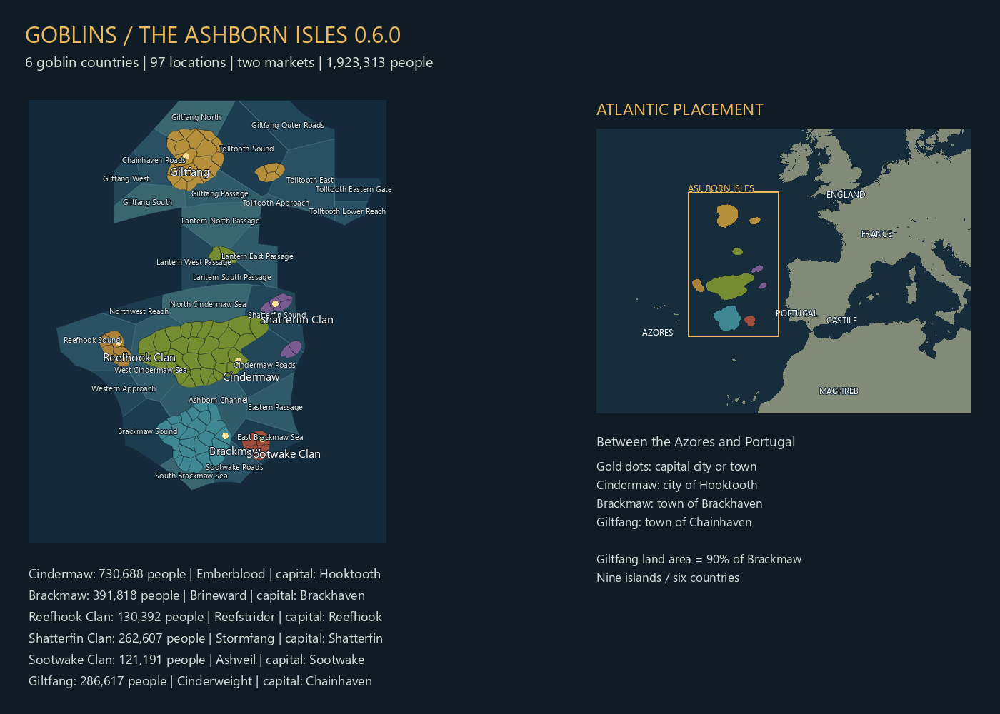
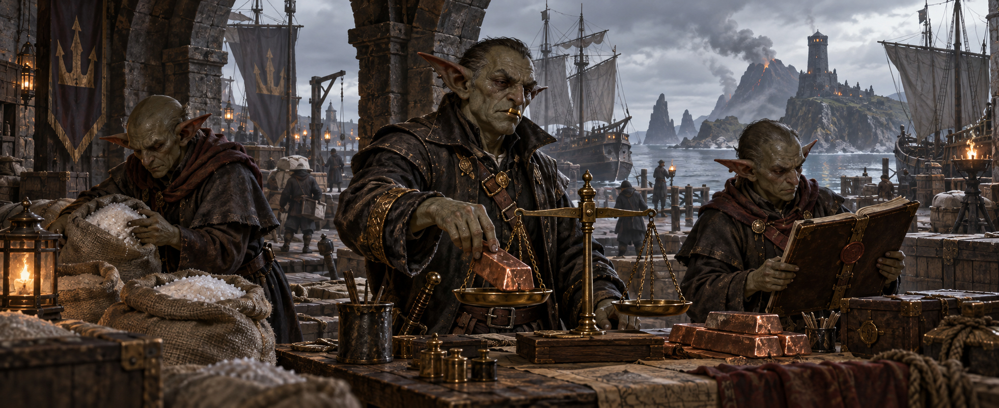
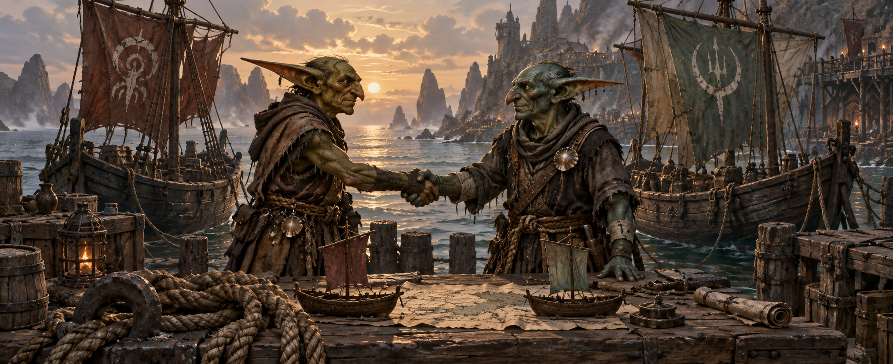
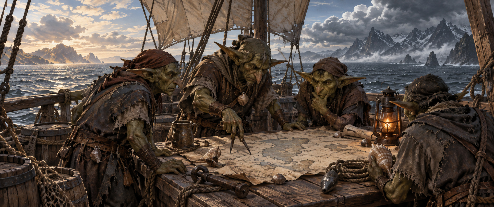
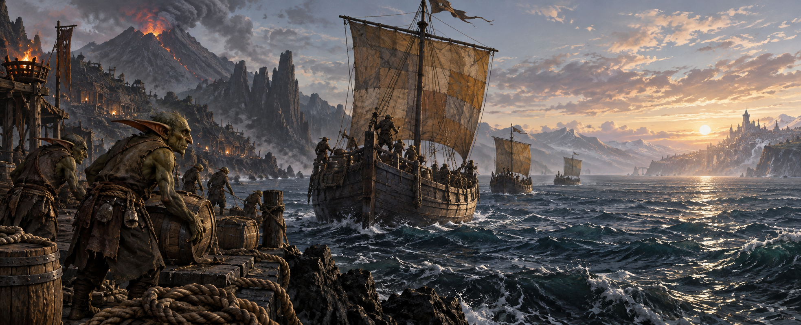

# Goblins of the Ashborn Isles

**Release 0.6.1 — Starting economy, connected provinces and distinct goblins.**

[0.6.1 release notes](RELEASE_NOTES_0.6.1.md) | [Download 0.6.1](https://github.com/stonefletcher/eu5-goblins-ashborn-isles/releases/tag/v0.6.1) | [Steam Workshop](https://steamcommunity.com/sharedfiles/filedetails/?id=3814944518)

Fire rose from the Atlantic. When the smoke cleared, goblin kingdoms stood among the new volcanic islands between the Azores and Portugal. Captains claimed sheltered harbors, smiths built their forges beneath black ridges, and rival houses began arguing over who should lead them.

**Goblins of the Ashborn Isles** adds a fantasy homeland to Europa Universalis V. Choose a crown, develop its economy, bargain with neighboring rulers, and decide whether the Isles will unite through conquest, submission or dynastic union. Beyond the familiar shoals lie foreign ports and the promise of an eastern foothold.

## 0.6.1 — Starting economy, connected provinces and distinct goblins

- All six crowns start with State Piracy selected and permanently unlocked through the native policy-unlock flag. The policy remains changeable; no later-age advance is granted.
- Starting stability is 50, legitimacy is 75 and prestige is 25.
- Hooktooth and Brackhaven start with a staffed sergeantry. Ironfang Monarchy grants +50% Manpower, increasing monthly manpower gain through the native `global_manpower_modifier`.
- Hooktooth and Chainhaven each receive two glass guilds, local sand supplies and two nearby mason levels. Supporting tools, leather, paper, jewelry and northern cloth production supply the workshops and marketplaces. Chainhaven gains a wharf and northern tar/silver resources support its production chains.
- Province assignments follow real shared land borders across all nine islands, including Smokehorn, Scorchbrook, the disconnected outer provinces and Giltfang. District shapes and country ownership are unchanged.
- Lantern Haven becomes a town with a marketplace, wharf and granary, keeping its fish resource and existing population.
- All ten coastal goblin towns/cities have one wharf. Netjaw is inland, so its invalid wharf is removed; Copperfang and Rustpeak also remain inland. Brackhaven is promoted to a city.
- Starting trade is explicitly seeded: Cindermaw imports silver from Chainhaven into Hooktooth; Giltfang imports lumber from Hooktooth into Chainhaven. Each requests one merchant-capacity unit and is locked against automatic cancellation, while remaining player-editable. Startup checks require a merchant, available capacity and a route; a bounded monthly retry covers initialization delays through November 1338. Completed routes are never recreated after cancellation.
- Additional towns: Copperfang and Netjaw (Cindermaw), Rustpeak and Bracknet (Brackmaw), Knifeback on Shatterfin's smaller island, and Tolltooth. Brackhaven, Shatterfin and Chainhaven become cities. Nearby rural households relocate into the expanded settlements; urban class mixes and production buildings change while each kingdom's total population stays constant.
- Covenant Favor is shown as a live value in the Gathering and Eastern Hunger panels, with an explanation of its religious-influence resource and rite costs. The native Religion panel retains the detailed resource tooltip.
- Adult male goblins draw from four distinct facial profiles, in addition to their existing hair choices. Drogg has a heavier brow, stronger jaw, leaner cheeks, prominent battle scar and a dedicated bear-hunter outfit.
- Cold Seas and Foreign Harbors uses story prose followed by a clear discovery summary. Voyages reveal bounded coastal pockets and market centers; the northern return charts southern Britain, Atlantic France, parts of Spain and northern Morocco, including London, Bordeaux, Seville and Fez. Most inland territory stays unknown.

**New 1337 campaign required** for the starting stats, policy, production, town and province assignments. Existing saves retain their saved starting world. Portrait/UI rendering, actual market membership, production ramp-up and profitable trades require in-game acceptance.

Goods move within a market through market access; this does not create an inter-market trade route. Between Hooktooth and Chainhaven, native country/burgher trade still depends on access, demand, prices, transport cost and available merchant capacity. The setup supplies production, merchant infrastructure and the two seeded routes. Goods inside Hooktooth are allocated by market access; a same-market trade route is rejected by the native trade action. Profitability, actual market membership and route activity must be checked in game.

## Previous release: 0.6.0

- **Giltfang, the sixth crown:** a northern realm with its own market, court, culture, lore, flag and opening artwork.
- **Lantern Cay and the Quiet Road:** a Cindermaw outpost and ordinary coastal passage connecting the northern and southern islands.
- **Two markets and mutual discovery:** Chainhaven joins Hooktooth as a market center; every goblin crown begins knowing the homeland and surrounding waters.
- **Clearer events:** shorter prompts, highlighted hover rewards, readable requirements and signed bargains explaining both partners' commitments.
- **A separate Ashborn Voyages situation**, 25-gold starting projects, clearer food-storage descriptions and corrected clan-flag assignments.

## An Atlantic homeland

*Map diagram generated from the mod's geography, not an in-game screenshot.*

The Isles contain **97 districts, 75 ports and 28 coastal sea tiles**, with 1,923,313 people at the start. Volcanic highlands, marshes, woodland and fisheries give each crown a different base of resources and settlements.

Giltfang and its smaller companion, Tolltooth, lie north of Cindermaw. Together they are about 10% smaller than Brackmaw. Between north and south, Cindermaw's new **Lantern Cay** adds Lantern Haven, Wickwood and Emberwatch. The Quiet Road provides a connected route through ordinary coastal water, with the lower eastern approach opened and selected current tiles reworked.

## Choose your crown

Every crown has its own culture, ruling household, introduction and three starting projects. All six participate in shared diplomacy, religion, exploration and unification.

**Cindermaw — Emberblood.** Drogg, the Stone Fletcher, rules the largest realm from Hooktooth. Forges, muster yards and volcanic defenses support his ambition to lead the Isles.

**Brackmaw — Brineward.** Murgash, the Sluice-King, builds influence through provisions, waterways and remembered debts. Marsh engineers and harbor workshops sustain Brackhaven's rival crown.

**Reefhook — Reefstrider.** Skrezz, the Wreck-Taker, rules among pilots, fishing households and pearl divers. Rescue obligations, salvage claims and foreign friendships all compete for his attention.

**Shatterfin — Stormfang.** Jaima, the Mare-Mother, leads the Tidemothers across two islands. Her court bargains for security while preserving its maternal royal house and succession.

**Sootwake — Ashveil.** Snikh, the Blackbough, guards the woodland paths and charcoal hearths that sustain his smaller realm. Independence rests on the groves as much as the crown.

**Giltfang — Cinderweight.** Vrekk, the Brass-Tooth, turned salvage disputes and trusted copper weights into harbor fees, armed crews and a crown. Copper workings and salt pans supply Chainhaven's market, while Tolltooth's lamps guard the approach. His projects support honest weights, harbor envoys or a supplied watch.

The clans share an Ashborn identity, with distinct names, dynasties, courts and original artwork. Read the [lore and royal-family stories](LORE.md) for their origins and rivalries.

## Gather the crowns

The Gathering turns the homeland into a shared contest for leadership. Build alliances, offer paid aid, negotiate submission and Compact charters, or press your claims through normal EU5 warfare. Other crowns can refuse; an offer is not a guaranteed treaty.

Unification requires all **97 homeland districts** within your realm through direct ownership, qualifying vassals or senior unions. Alliances and temporary wartime occupation do not unite the Isles. The situation panel shows the founding crowns and progress toward that goal.

## Harbors, provisions and promises

Harbor Bargains let independent crowns negotiate provisions or pilot services for five years. Payment happens when the agreement is signed. A counteroffer can change the service and price, and each partner receives a receipt explaining the benefit, burden and duration.

Hooktooth and Chainhaven begin with separate markets. Fisheries, mines, woodland crafts and urban workshops give the islands different economic foundations; actual trade and profitability depend on EU5's market systems and the course of your campaign.

Each crown starts with **100 gold**. Its three opening projects cost **25 gold** each. Food bonuses raise the **province food storage limit**, not monthly production: hover the province food display and then the stockpile total to inspect capacity and its modifiers.

## Chart the foreign shores

The separate **Ashborn Voyages** situation tracks preparation, a route at sea, returning crews, rest and completed charts. Fund expeditions toward Iberia, northern waters or northwest Africa. The first offer follows 36 months of preparation; voyages cost gold and take time.

You can request a later reminder or commission available routes manually. Returning crews reveal limited coastal destinations, and reciprocal contact lets the countries they visit learn about the Isles. Foreign land is not all revealed at the start.

## The Eastern Hunger and the Ashen Covenant

Once the homeland is united, the **Eastern Hunger** turns attention toward a European coastal foothold. Prepare your fleet and select an eligible objective, then pursue it through normal declarations of war and peace settlements. You must build the forces and win the land yourself.

At home, the **Ashen Covenant** provides twelve sacred sites, traditions, rites, Favor and religious stories. Its choices sit alongside clan politics and the demands of the ruling household. Earlier portrait, skin, hairstyle, Drogg, wardrobe and holy-site fixes remain included.

## Install and continue

Built for **EU5 1.3.11 (Pavia)**. Upgrading to 0.6.1 requires a **new 1337 campaign** because province assignments and starting setup changed.

- Subscribe through the Workshop, or download **Goblins_Ashborn_Isles_0.6.1.zip** from the release above, extract it and run **Install-Goblins.cmd** with EU5 closed. The installer reconstructs its terrain using the installed game.
- Enable only one Goblins copy and disable the old Gathering Prototype add-on. Restart before playing.
- Existing 0.6.0 saves can receive the clan-flag repair after restart and the next monthly pulse; that repair alone needs no new campaign.
- Other map, terrain and starting-world mods may conflict. Keep separate saves.

## Checks and feedback

Development packaging creates the player installer by default. Use `python tools/package.py --source` only when a separate source ZIP is needed; GitHub already supplies source downloads. Reuse verified build stages and keep one current clean-test workspace.

The complete 0.6.1 static build, economy, connected-province, portrait asset and voyage script checks have passed. The city/wharf/seeded-trade follow-up passed full static validation, clean-source reconstruction and isolated installation; all 1,977 delivered files matched the build. These checks are separate from in-game confirmation of production, trade, UI rendering, portraits and save behavior. Multiplayer and achievements are unverified; dedicated foreign invasion ambitions and fear mechanics are not included.

[Report a problem](https://github.com/stonefletcher/eu5-goblins-ashborn-isles/issues) with your version, clan, enabled mods and steps to reproduce it. Screenshots and relevant saves help. See the [release history](RELEASE_NOTES.md) and [playtest checklist](TESTING.md) for more detail.

## Credits

Original setting and development by Stonefletcher. Base goblin infantry model: Quaternius, Ultimate Animated Character Pack (CC0). Paintings, banner and thumbnail use AI-generated artwork; map diagrams use the mod's generated geography. Europa Universalis V and its original assets belong to Paradox Interactive. This is an unofficial mod.
