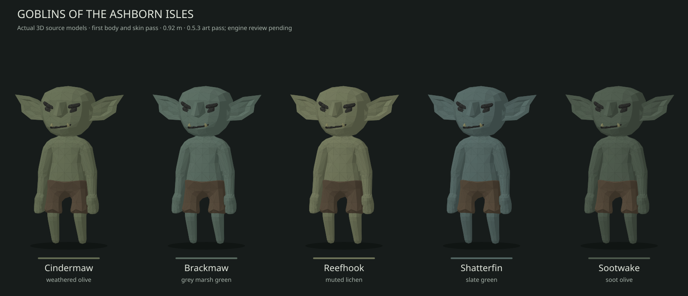

# Ashborn goblin model prototypes

**Native infantry prototype integrated into main. Editable GLB sources and the first EU5 mesh/animation export are included; in-game rendering is still unverified.**



The common body is short (1.12 metres in the first Idle frame) with a large head, a broad lower jaw, a hooked nose, longer pointed ears, narrow slanted eyes, uneven tusks and a crooked mouth. Skin is matte. Clan differences are deliberately modest and concentrate on green pigmentation.

| Clan | Country | Culture | Skin | sRGB |
|---|---|---|---|---|
| Cindermaw | CDM | Emberblood | Warm olive | #71834B |
| Brackmaw | QBR | Brineward | Sea green | #56856B |
| Reefhook | RHK | Reefstrider | Yellow moss | #82965B |
| Shatterfin | SFK | Stormfang | Blue green | #537B76 |
| Sootwake | SWK | Ashveil | Dark forest green | #51634B |

## Models

Each file is self-contained binary glTF 2.0, suitable for import into a 3D editor that supports GLB. No external textures are needed.

- [Cindermaw](variants/cindermaw.glb)
- [Brackmaw](variants/brackmaw.glb)
- [Reefhook](variants/reefhook.glb)
- [Shatterfin](variants/shatterfin.glb)
- [Sootwake](variants/sootwake.glb)

All five share the same sculpt and original 23-joint skeleton. Each has 2,476 triangles and retains 17 source animations: Death, Defeat, Idle, Jump, PickUp, Punch, RecieveHit, Roll, Run, Run_Carry, Shoot_OneHanded, SitDown, StandUp, SwordSlash, Victory, Walk and Walk_Carry. The upstream spelling of RecieveHit is preserved.

The nose is new geometry weighted to the existing Head joint. The head, ears, eyes, jaw, mouth and teeth were reshaped; body topology and original skin weights are retained. A parent transform sets stature and ground height without rewriting animation tracks. This is an unarmoured adult male body prototype. Clothing, weapons, additional bodies, portrait facial animation and EU5 materials remain to be made.

[Animation pose inspection](preview/animation_poses.svg) shows sampled middle keyframes, not a video. Both previews render the actual skinned geometry.

## Source and credit

Base: **Goblin_Male** from Quaternius's **Ultimate Animated Character Pack, November 2019**.

- [Creator's pack page](https://quaternius.com/packs/ultimatedanimatedcharacter.html), which identifies this pack as CC0.
- [Original embedded source](source/Goblin_Male.gltf)
- [Upstream license text](source/License.txt)
- [CC0 1.0](https://creativecommons.org/publicdomain/zero/1.0/)
- Exact retrieval location and Git blob are recorded in [clans.json](clans.json).

The source was retrieved from a public mirror of the original pack. Its license file agrees with the creator's pack page. The unmodified upstream source is retained for reproducibility. No Paradox meshes or textures are included.

## Rebuild

With Node.js installed, run from the repository root:

```powershell
node art/models/goblins/tools/build.mjs
```

The script verifies the upstream Git blob hash, applies the common sculpt, assigns the five skin palettes, generates GLB files and regenerates the geometry contact sheet. It uses only Node built-ins. The generator has now run locally on Windows with Node.js. All five rebuilt GLBs matched the art branch blob hashes exactly.

Edit clans.json to change the palette or target height. The checked-in variants are the result of the checked-in sculpt and generator. EU5's final world scale must be calibrated against a native unit; 1.12 m here is an art-source measurement.

## Verification and next integration step

[validation.json](validation.json) records checks performed on the generated files: GLB header/chunk round trip, every accessor's bounds and finite values, triangle indices, skin weights, joint indices, animation timestamps/quaternions, preserved original animation metadata/skin topology, common ground/height and 51 sampled animation poses. The five skin variants and representative action poses were visually inspected through a CPU skinning renderer.

Native export now uses tools/export_goblin_models.py and tools/pdx_binary.py. Five clan meshes use native unit materials, with 17 shared animation clips and 25 exported bones (23 original joints plus two transform ancestors). Original scalar stature is retained; tiny exporter scale noise is averaged to match native scalar animation records. Native units use the same 0.08 schematic scale; goblin source height is 1.12 m before that world scale.

[native_validation.json](native_validation.json) records independent decoded skinning checks on 51 poses, finite vertices and unit weights, animation quaternions, consistent bone indexing and byte-exact round trips of installed native files. The largest measured pose difference is about 0.00111 cm. The game bindings select each clan for light/heavy infantry. Idle, movement, attack, retreat and charge are wired; the death clip is exported but its in-game trigger remains unverified.

Rebuild runtime files and the main installer manifest with `python tools/prepare_main_overlay.py --game "PATH/TO/EU5/game"`. The source-only generator still uses Node.js. Native generated files are under mod/in_game/gfx/models/units/ashborn_goblins; texture colors convert the source linear values to sRGB. The CC0 source credit above remains applicable.

Still pending: in-game rendering and animation, Blender import, the official Khronos validator, weapon/clothing fitting, cavalry and artillery crews. Portraits now use the native facial rig with custom features, described below; these infantry bodies are not portrait heads. The published 0.5.0 package is unchanged; Download ZIP from main applies this development update through its installer.


## Culture-based portrait test pass (main only)

All five Ashborn cultures now select their own portrait ethnicity and deterministic
appearance modifier. The rules follow the character's culture, not their employer,
country, sex, or office. This targets ruling families, cabinet members, other
characters and culture-generated population portraits. Existing character DNA gets
the visible modifiers without a save-edit migration. Newly generated DNA also uses
the culture's ethnicity. Human cultures receive none of these modifiers.

The pass uses the native animated portrait faces and clothing, with custom rigged
pointed ears, jaw-bound tusks, goblin facial proportions, and matching head/body skin
colour. It does not reuse the infantry's whole-body mesh as a portrait. Adult male,
adult female, boy, girl, both adolescent types and infant are configured; infants
have smaller ears without tusks. Clan colours match the infantry art palette.

**Status: static checks passed; in-game appearance has not been verified.** Native
rig bindings, skin weights, geometry, asset references, all seven portrait types,
and all five culture routes are checked by `tools/verify_goblin_portraits.py`.
Clothing fit, expressions, child scaling and population portrait selection still
need a game test. Restart EU5 after installing a fresh main download; the published
0.5.0 ZIP does not contain this pass. Compare a ruler, relative, cabinet member,
woman, child and infant from each culture, plus a human character as a control.
Check skin on neck/hands, eyes, ear placement, tusks during animation, save/reload,
and a newly generated character. Send a screenshot and fresh error.log if wrong.

The separate infantry integration currently fails in-game with `Invalid entity
graph [cm_goblin_cindermaw_schematic]`, producing invisible infantry. Its repair is
deferred while portraits are prioritised; this portrait pass does not claim to fix it.
